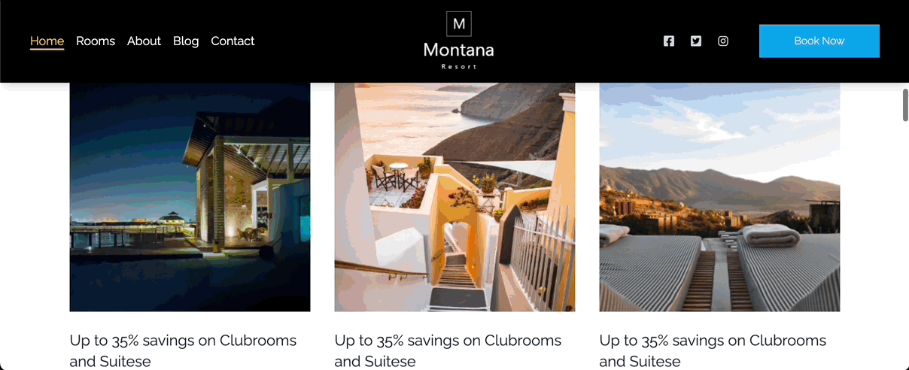

# Montana Resort Project

Welcome to the Montana Resort project! This repository contains the source code for a modern and responsive website designed for a luxurious resort. With this project, you can explore a dynamic frontend built to captivate users with an intuitive design and rich features.



## Features
- Responsive design optimized for all devices.
- Interactive sections showcasing resort features and amenities.
- Dynamic navigation and user-friendly UI components.
- Scalable and customizable for any resort.

---
---

## Getting Started

Follow these instructions to clone and run the project locally.

## Prerequisites

Ensure you have the following installed on your machine:
- [Node.js](https://nodejs.org/) (v14 or later)
- [Git](https://git-scm.com/)

---

## Installation

1. Clone the repository:
   ```bash
   git clone https://github.com/Uhiene/montana-resort
   ```

2. Navigate to the project directory:
   ```bash
   cd montana-resort
   ```

3. Install the dependencies:
   ```bash
   npm install
   ```

---

## Usage

1. Start the development server:
   ```bash
   npm run dev
   ```

2. Open the link on the terminal:
   ```
   http://localhost:3000
   ```

3. Explore the Montana Resort website and modify as needed.

---

## Technologies Used

- **Frontend:** React, Tailwind CSS

---

## Contributing

We welcome contributions to improve the Montana Resort project! Follow these steps:
1. Fork the repository.
2. Create a new branch:
   ```bash
   git checkout -b feature/your-feature-name
   ```
3. Commit your changes:
   ```bash
   git commit -m "Add your message here"
   ```
4. Push to your branch:
   ```bash
   git push origin feature/your-feature-name
   ```
5. Open a Pull Request.

---
